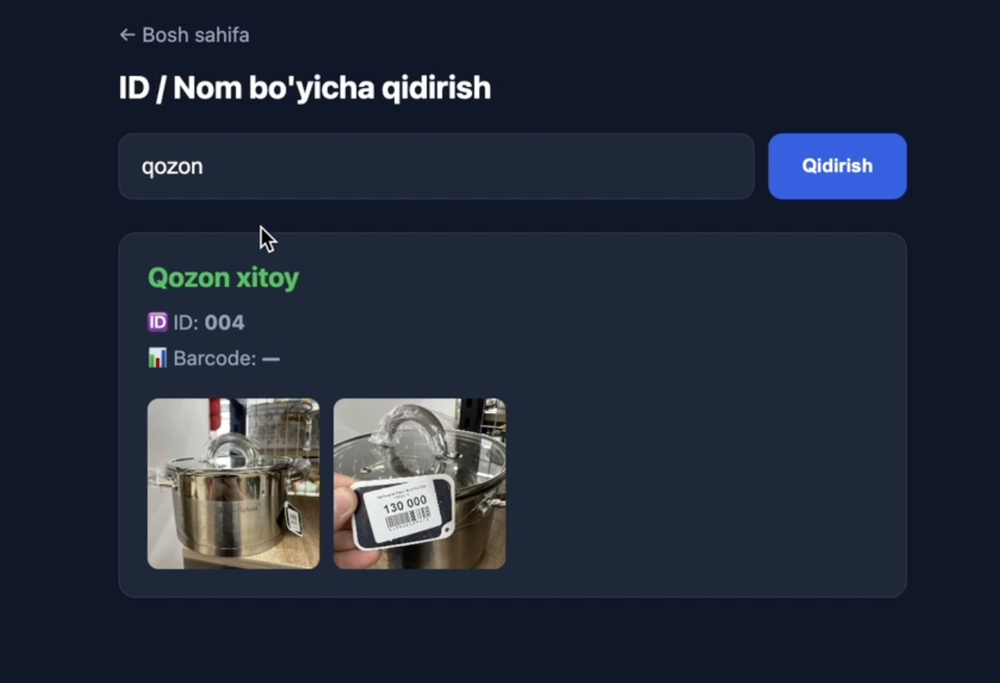
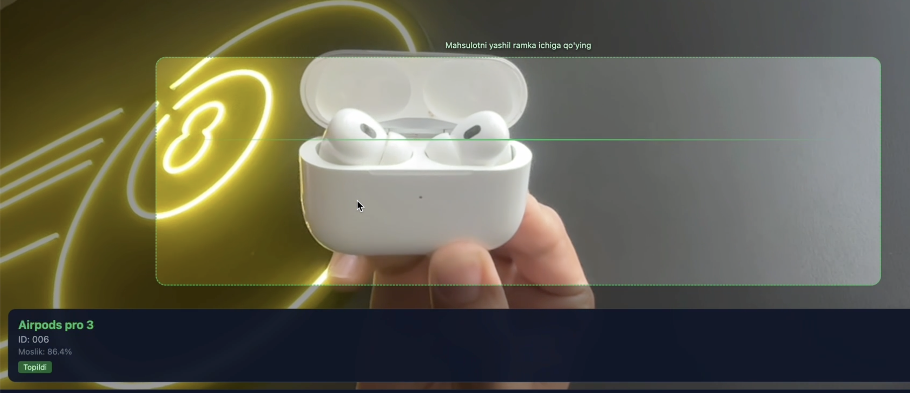
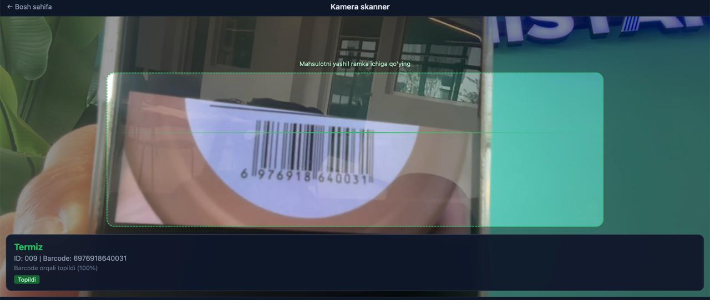
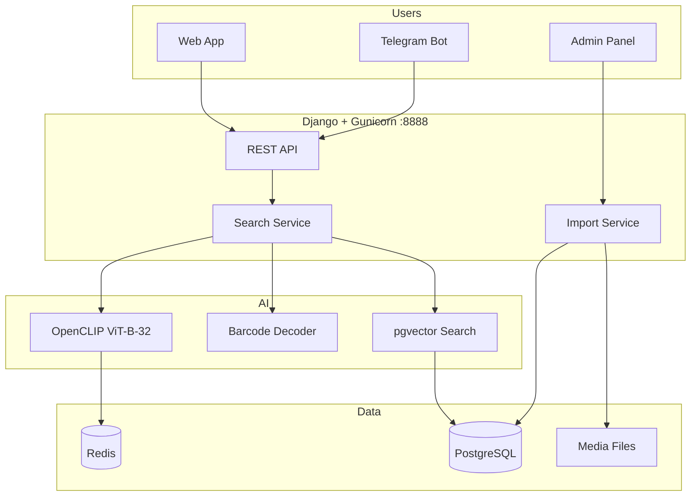

# Product Scanner

**AI-powered product identification for retail & warehouse operations**

[](https://github.com/AzizbekGulomov2002/product-scanner)

---

## English

### Overview

**Product Scanner** is an end-to-end solution for **retail and warehouse** teams managing large product catalogs (designed for **55,000+ SKUs**). Staff can **find any product instantly** using:

- **Barcode** (EAN-13, UPC, Code128, …)
- **Product photo** (camera or uploaded image)
- **ID or name** lookup

The system includes a **web app**, **Telegram bot**, and **Django admin panel** for catalog management, bulk import, and monitoring.

---

### The problem

In large warehouses and retail chains, workers waste time searching ERP screens or asking colleagues when they only have a **photo**, **barcode**, or **partial product name**. Manual lookup does not scale to tens of thousands of items.

### The solution

| Layer | What it does |
|-------|----------------|
| **Catalog** | Store products with ID, name, barcode, multiple images per SKU |
| **Vision AI** | OpenCLIP embeddings + pgvector similarity search |
| **Barcode** | pyzbar + browser `BarcodeDetector` for instant exact match |
| **Channels** | Web scanner, Telegram bot, REST API, admin |
| **Scale** | Bulk Excel+ZIP import, background Celery indexing |

---

### Screenshots

**Web — search by ID / name**



**Telegram — search by image**



**Realtime scanner — barcode**



---

### Architecture (high → low level)



**Request flow (image search)**

1. User sends photo (web / Telegram / camera frame)
2. **Barcode first** — if detected → exact DB lookup (100% match)
3. Else **CLIP embedding** → cosine similarity in pgvector
4. Confidence rules filter false positives
5. Product name, ID, barcode, images returned

---

### Features

| Feature | Web | Telegram | Admin |
|---------|:---:|:--------:|:-----:|
| Search by image | ✅ | ✅ | ✅ (test) |
| Search by barcode | ✅ | ✅ | — |
| Search by ID / name | ✅ | ✅ | ✅ |
| Realtime camera scanner | ✅ | — | — |
| Add product | ✅ | ✅ | ✅ |
| Bulk Excel + ZIP import | — | — | ✅ |
| Embedding reindex | — | — | ✅ |
| Search history | — | — | ✅ |

---

### Tech stack

| Component | Technology |
|-----------|------------|
| Backend | Django 5, DRF, Gunicorn |
| Database | PostgreSQL + pgvector |
| AI | OpenCLIP (ViT-B-32), PyTorch |
| Barcode | pyzbar, BarcodeDetector API |
| Tasks | Celery + Redis |
| Bot | aiogram 3 |
| Frontend | HTML templates (scanner, dashboard) |
| Admin UI | Jazzmin |

---

### Quick start (local)

```bash
git clone https://github.com/AzizbekGulomov2002/product-scanner.git
cd product-scanner

python3 -m venv venv
source venv/bin/activate
pip install -r requirements.txt

cp .env.example .env
# Edit .env — set TELEGRAM_BOT_TOKEN, PostgreSQL, Redis

python manage.py migrate
python manage.py create_admin
python manage.py collectstatic --noinput

# Terminal 1 — server
make server

# Terminal 2 — bot
make bot

# Terminal 3 — embedding worker
make worker
```

| URL | Description |
|-----|-------------|
| http://localhost:8000/ | Dashboard |
| http://localhost:8000/scanner/ | Realtime camera |
| http://localhost:8000/admin/ | Admin (`admin` / `admin123`) |

---

### Production (single systemd service)

Runs **Gunicorn :8888 + Celery + Telegram bot** in one service:

```bash
sudo ./deploy/install-searcher.sh /opt/product-scanner
sudo systemctl start searcher
sudo systemctl enable searcher
```

See `deploy/searcher.service` and `scripts/run-searcher.sh`.

**.env production example:**

```env
DEBUG=False
ALLOWED_HOSTS=YOUR_SERVER_IP,localhost
BACKEND_URL=http://YOUR_SERVER_IP:8888
GUNICORN_BIND=0.0.0.0:8888
```

---

### Bulk import (55K products)

Use `sample_data/` templates:

| File | Purpose |
|------|---------|
| `products_template.xlsx` | Excel template |
| `product_images_folder_example.zip` | Images by folder ID |
| `IMPORT_GUIDE.md` | Full import guide (Uzbek) |

**Excel columns:** `external_id`, `name`, `barcode` (optional), `image_files` (optional)

**ZIP structure (recommended):**

```
product_images.zip
├── 001/
│   ├── front.jpg
│   └── back.jpg
└── 002/
    └── side.jpg
```

Admin → **Bulk Import** → upload Excel + ZIP → embeddings build in background.

---

### API

| Endpoint | Method | Description |
|----------|--------|-------------|
| `/api/search/image/` | POST | Image upload (multipart) |
| `/api/search/barcode/` | POST | `{"barcode": "..."}` |
| `/api/search/realtime/` | POST | `{"frame": "base64...", "barcode": "..."}` |
| `/api/products/lookup/?q=` | GET | Search by ID, name, or barcode |
| `/api/products/create/` | POST | Create product with images |

---

### Project structure

```
├── bot/                 # Telegram bot (aiogram)
├── config/              # Django settings, Celery, URLs
├── deploy/              # searcher.service, install script
├── products/            # Product model, bulk import
├── search/              # AI search, embeddings, barcode
├── sample_data/         # Import templates & examples
├── screenshots/         # App screenshots
├── scripts/             # Run scripts, production launcher
├── templates/           # Web UI & admin templates
└── requirements.txt
```

---

### Confidence thresholds

Configured in `.env`:

| Variable | Default | Meaning |
|----------|---------|---------|
| `CONFIDENCE_HIGH` | 0.88 | Strict match (Telegram / API) |
| `CONFIDENCE_MEDIUM` | 0.82 | Probable match |
| `REALTIME_CONFIDENCE_HIGH` | 0.80 | Camera — found |
| `REALTIME_CONFIDENCE_MIN` | 0.72 | Camera — minimum |

Barcode matches are always **100%** when the code exists in the database.

---

## O'zbekcha

### Umumiy ma'lumot

**Product Scanner** — **retail va omborxona** korxonalari uchun mahsulotlarni tez topish tizimi. **55 000+ mahsulot** katalogi bilan ishlash uchun mo'ljallangan.

Xodimlar mahsulotni quyidagilar orqali topadi:

- **Shtrix-kod (barcode)**
- **Rasm** (kamera yoki yuklangan foto)
- **ID yoki nom**

Tizimda **web ilova**, **Telegram bot** va **admin panel** mavjud.

---

### Qanday muammoni hal qiladi?

Katta savdo va omborxonalarda xodimlar mahsulotni topish uchun ERP da qidiradi yoki hamkasblaridan so'raydi. **Faqat rasm yoki barcode** bo'lganda bu sekin va samarasiz.

### Yechim (yuqori → past daraja)

1. **Katalog** — har mahsulot: ID, nom, barcode, bir nechta rasm
2. **AI** — OpenCLIP embedding + pgvector vector qidiruv
3. **Barcode** — aniq moslik (100%), AI dan oldin tekshiriladi
4. **Interfeyslar** — web skanner, Telegram bot, REST API
5. **Masshtab** — Excel+ZIP import, Celery orqali fon indekslash

---

### Skrinshotlar

**Web — ID / nom bo'yicha qidirish**


**Telegram — rasm bo'yicha qidirish**


**Kamera skanner — barcode**


---

### Imkoniyatlar

- **Web dashboard** — 3 ta tugma: qidirish, kamera, mahsulot qo'shish
- **Realtime kamera** — fullscreen, barcode + AI
- **Telegram bot** — ID / nom / rasm bo'yicha qidirish, mahsulot qo'shish
- **Admin** — Jazzmin, bulk import, qidiruv tarixi, embedding reindex
- **API** — boshqa tizimlar bilan integratsiya

---

### Tez ishga tushirish

```bash
git clone https://github.com/AzizbekGulomov2002/product-scanner.git
cd product-scanner

python3 -m venv venv
source venv/bin/activate
pip install -r requirements.txt

cp .env.example .env
# TELEGRAM_BOT_TOKEN, PostgreSQL, Redis sozlang

python manage.py migrate
python manage.py create_admin

make server    # Django
make bot       # Telegram bot
make worker    # Embedding worker
```

---

### Serverga joylash (bitta service)

```bash
sudo ./deploy/install-searcher.sh /opt/product-scanner
sudo systemctl start searcher
```

Bitta `searcher.service` ichida: **Gunicorn :8888 + bot + Celery worker**.

---

### Ommaviy import (55K mahsulot)

`sample_data/` papkasidagi shablonlardan foydalaning:

- `products_template.xlsx` — Excel shablon
- `product_images_folder_example.zip` — rasm ZIP namunasi
- `IMPORT_GUIDE.md` — batafsil qo'llanma

**ZIP (tavsiya etiladi):**

```
001/
  rasm1.jpg
  rasm2.jpg
002/
  rasm1.jpg
```

Admin → **Bulk Import** → Excel + ZIP yuklang.

---

### Texnologiyalar

Django, PostgreSQL, pgvector, OpenCLIP, Celery, Redis, aiogram, pyzbar, Gunicorn.

---

## License

MIT — use freely for internal retail & warehouse projects.

## Author

[Azizbek Gulomov](https://github.com/AzizbekGulomov2002)
